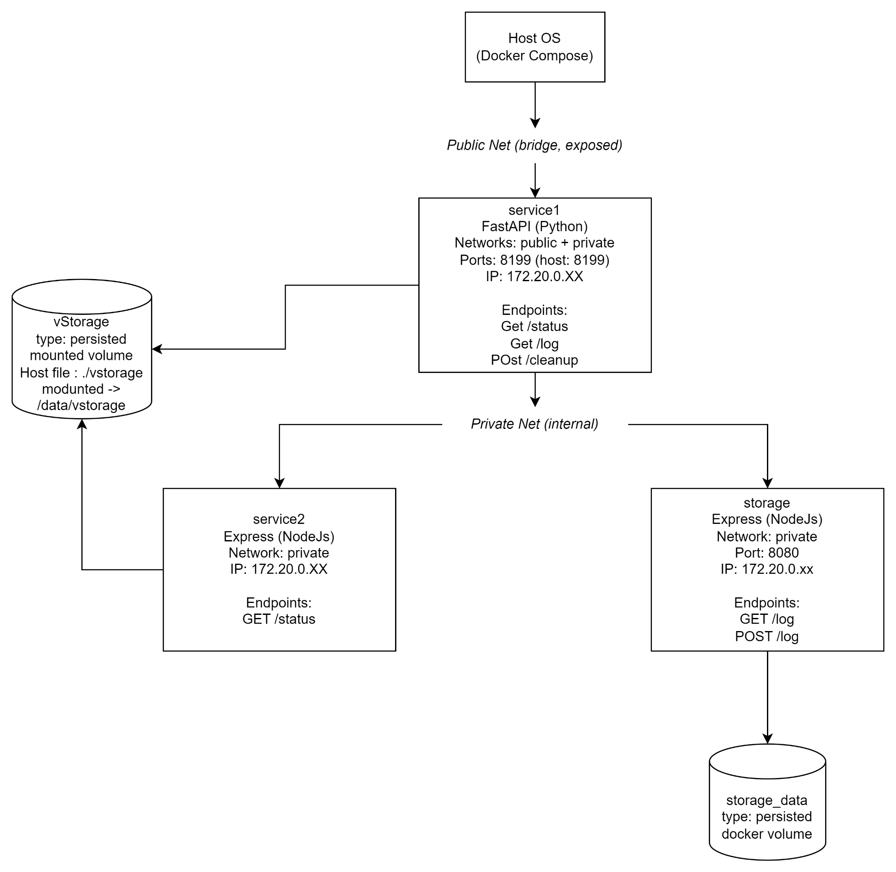

# Basics of Containers and Microservices



## Clone the Repository
```bash
git clone -b exercise1 https://github.com/Saurav-Paul/DevOps_Course.git
cd DevOps_Course
```

## Start the Stack
```bash
docker compose up --build -d
```

## Check Health Status
```bash
curl localhost:8199/health
```

## Hit Service Endpoints
```bash
curl localhost:8199/status
curl localhost:8199/log
```

## Verify Storage Sync
```bash
diff -u <(curl -s localhost:8199/log) <(cat ./vstorage)
```

## Cleanup Logs

*using the api,*
```bash
curl -X POST localhost:8199/cleanup
```

*or cleaning up manually,* 
```bash
docker compose down -v
: > ./vstorage
```

## Shut Everything Down
```bash
docker compose down
```
